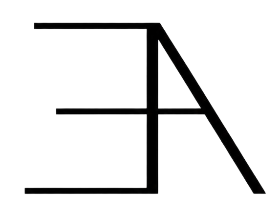

# Echo Apply — Autonomous AI Career Copilot & Job Application Engine

<div align="center">



### *Your intelligent, end-to-end career operating system powered by Gemini 2.5, FastAPI, and Next.js.*

[](https://nextjs.org/)
[](https://fastapi.tiangolo.com/)
[](https://python.org/)
[](https://www.typescriptlang.org/)
[](https://tailwindcss.com/)
[](https://supabase.com/)
[](https://deepmind.google/technologies/gemini/)

[Live Demo](https://echo-apply.vercel.app) • [Architecture](#architecture--tech-stack) • [Features](#key-features) • [Installation](#getting-started) • [Deployment](#production-deployment)

</div>

---

## Product Showcases

<div align="center">

### Intelligent Dashboard & Ambient Pretext Serpent

*Real-time job matching, custom resume manager, and zero-reflow typography physics.*

</div>

<br/>

| Truthfulness-Gated Resume Tailoring | Dynamic Cover Letter Studio |
| :---: | :---: |
|  |  |
| *Multi-stage pipeline rewriting with strict zero-hallucination validation.* | *Instant role-targeted cover letters with automatic fallback resilience.* |

| AI Mock Interview Coach (STAR Method) | Autonomous Browser Auto-Applier |
| :---: | :---: |
|  |  |
| *Dynamic question generator with real-time STAR compliance scoring.* | *Playwright agent with human-in-the-loop CAPTCHA detection.* |

---

## Key Features

### 1. Deep Context Resume Tailoring & Truthfulness Gate
- **4-Stage LLM Pipeline**: Gap Analysis $\rightarrow$ Strategic Impact Scoring $\rightarrow$ Metric-Dense STAR Rewriting $\rightarrow$ Strict Truthfulness Gate.
- **Zero-Fabrication Guarantee**: Rejects or flags any claims, tools, or dates not grounded in the candidate's verified resume profile.
- **ATS Export**: Generates compliant, ATS-optimized PDFs and DOCX formats.

### 2. Resilient Cover Letter Studio
- Tailors 4-paragraph cover letters matching specific Job Descriptions in seconds.
- **Multi-Model Fallback Chain**: Google Gemini 2.5 Flash $\rightarrow$ Groq LLaMA 3.3 70B $\rightarrow$ OpenRouter $\rightarrow$ Deterministic Heuristic Synthesis (100% uptime).
- Built-in live PDF intake and JD quick presets (*Full-Stack*, *Frontend*, *Backend*).

### 3. AI Mock Interview Practice & STAR Coach
- Generates 5 customized technical and behavioral interview questions mapped to the candidate's actual work history and target JD.
- **Dynamic Real-Time Scoring (0–100)** evaluating:
  - STAR Method Compliance (Situation, Task, Action, Result)
  - Technical Depth & Tool Rigor
  - Communication Clarity & Actionable Tips
- Includes 1-click sample answer auto-fillers for rapid practice.

### 4. Multi-Board Real-Time Job Crawler & Smart Matching
- Continuously aggregates listings from **RemoteOK**, **Himalayas**, **Jobicy**, **Reed**, and **Adzuna**.
- Semantic alignment calculations (0–100%) ranking openings by skills overlap, seniority match, and industry relevance.

### 5. Autonomous Browser Agent (Playwright Auto-Applier)
- Automated job application filling on Greenhouse, Lever, Workday, and custom career portals.
- **Human-in-the-Loop Handover**: Pauses and notifies the user if an interactive CAPTCHA or multi-factor authentication check is detected.
- Encrypted cookie synchronization and credential isolation.

### 6. Pretext Arithmetic Layout Engine
- Sub-pixel kinetic text animation and ambient mascot powered by `@chenglou/pretext`.
- Eliminates browser layout thrashing (`getBoundingClientRect`) by caching document spatial coordinates for fluid 60–120 FPS performance.

---

## Architecture & Tech Stack

```
                               ┌────────────────────────────────┐
                               │       Next.js 14 Frontend      │
                               │   (TypeScript, TailwindCSS,    │
                               │    Pretext Kinematics Engine)  │
                               └───────────────┬────────────────┘
                                               │ HTTPS / REST
                               ┌───────────────▼────────────────┐
                               │       FastAPI Backend API      │
                               │  (Python 3.13, Async Workers,  │
                               │   Rate Limiters, Auth Shields) │
                               └───────┬───────────────┬────────┘
                                       │               │
                     ┌─────────────────▼─────┐   ┌─────▼──────────────────┐
                     │ Multi-LLM Orchestrator│   │   Supabase Postgres    │
                     │  - Gemini 2.5 Flash   │   │  - Auth & JWT Security │
                     │  - Groq LLaMA 3.3 70B │   │  - Row-Level Security  │
                     │  - OpenRouter Fallback│   │  - Profile Store       │
                     └───────────────────────┘   └────────────────────────┘
```

| Layer | Technologies |
| :--- | :--- |
| **Frontend** | Next.js 14 (App Router), React 18, TypeScript, TailwindCSS, Lucide Icons, Canvas API |
| **Backend** | FastAPI, Python 3.13, Pydantic v2, Uvicorn, Asyncio, Pytest |
| **Database & Auth** | Supabase (PostgreSQL), Row-Level Security (RLS), Supabase Auth JWT |
| **AI / LLM** | Google Gemini 2.5 Flash, Groq (LLaMA 3.3 70B), OpenRouter |
| **Automation** | Playwright Chromium Headless Agent, BeautifulSoup4, WeasyPrint |
| **Performance** | `@chenglou/pretext` Arithmetic Engine, Spatial Cache Optimizer |

---

## Getting Started

### Prerequisites
- **Node.js**: `v18.17+` or `v20+`
- **Python**: `3.11+` (Python 3.13 recommended)
- **Supabase Account** (Free tier)
- **Google AI Studio API Key** (Free tier)

---

### 1. Clone Repository
```bash
git clone https://github.com/eyadarshad/EchoApply.git
cd EchoApply
```

---

### 2. Backend Setup
```bash
cd backend

# Create and activate virtual environment
python -m venv .venv
# On Windows:
.venv\Scripts\activate
# On Linux/macOS:
source .venv/bin/activate

# Install dependencies
pip install -r requirements.txt

# Configure environment
cp ../.env.example .env
# Edit .env and insert your SUPABASE_URL, GEMINI_API_KEY, and DATABASE_URL

# Start FastAPI server
uvicorn app.main:app --reload --port 8000
```

---

### 3. Frontend Setup
```bash
cd ../frontend

# Install dependencies
npm install

# Configure environment
# Ensure frontend/.env contains:
# NEXT_PUBLIC_BACKEND_URL=http://127.0.0.1:8000
# NEXT_PUBLIC_SUPABASE_URL=your-supabase-url
# NEXT_PUBLIC_SUPABASE_ANON_KEY=your-supabase-anon-key

# Start Next.js development server
npm run dev
```

Open [http://localhost:3000](http://localhost:3000) in your browser.

---

## Testing

```bash
# Run Backend Test Suite (Pytest)
cd backend
pytest tests/test_production_upgrade.py

# Run Frontend Tests (Vitest) & TypeScript Check
cd ../frontend
npx vitest run
npx tsc --noEmit
```

---

## Production Deployment

### Backend Deployment (Render / Railway)
1. Link your GitHub repository to [Render](https://render.com).
2. Set **Root Directory** to `backend`.
3. Set **Build Command** to `pip install -r requirements.txt`.
4. Set **Start Command** to `uvicorn app.main:app --host 0.0.0.0 --port $PORT`.
5. Add your environment variables from `backend/.env`.

### Frontend Deployment (Vercel)
1. Import your GitHub repository on [Vercel](https://vercel.com).
2. Set **Root Directory** to `frontend`.
3. Add `NEXT_PUBLIC_BACKEND_URL` pointing to your Render backend URL.
4. Add `NEXT_PUBLIC_SUPABASE_URL` and `NEXT_PUBLIC_SUPABASE_ANON_KEY`.
5. Click **Deploy**.

---

## Security & Privacy
- **Row-Level Security (RLS)**: Users can only query and mutate their own profile and application records.
- **Zero-Storage Secrets**: Sensitive API keys and credentials reside strictly in server-side memory.
- **Client Sanitization**: Public bundle contains only safe `NEXT_PUBLIC_*` identifiers.
- **GDPR Compliant**: Data retention and automated candidate profile purging tools included.

---

## License
This project is licensed under the **MIT License** — see the [LICENSE](LICENSE) file for details.

---

<div align="center">
Built by <a href="https://github.com/eyadarshad">Eyad Arshad</a>
</div>
