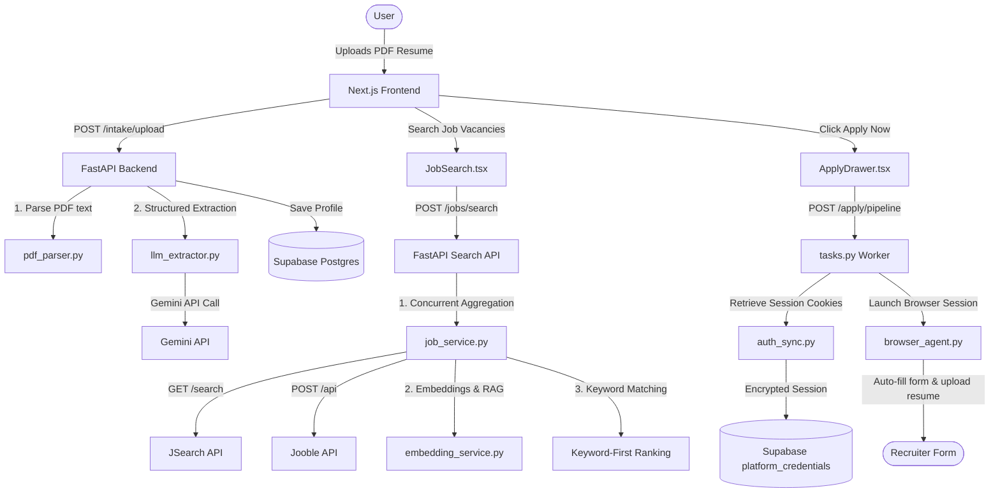

# SmartApply AI: Comprehensive System Architecture, Security, & Implementation Report

---

## Executive Summary
**SmartApply AI** is a state-of-the-art, production-ready career development and job application automation platform. It integrates a **Next.js 14 App Router** frontend, a high-performance **FastAPI** backend, a **PostgreSQL (Supabase)** database with vector extension (`pgvector`) support, and an automated **Playwright browser companion agent**. 

The system leverages generative AI (Google Gemini and OpenRouter fallback models) to:
1. Parse unstructured PDF resume uploads.
2. Cross-reference resumes against job descriptions to compute hybrid semantic matching scores.
3. Automatically execute a 7-stage resume tailoring pipeline incorporating recruiter-preferred X-Y-Z rewriting formulas and red-flag audits.
4. Orchestrate background browser sessions to automate job applications on LinkedIn, Indeed, and Glassdoor using encrypted session cookies.

This dossier serves as an exhaustive architectural and technical manual detailing the role, data flows, performance optimizations, and security implementations of every core module across the entire codebase.

---

## 1. High-Level System Architecture & Data Flows

The platform is designed around a decoupled client-server architecture. It isolates resource-intensive tasks (such as Playwright browser automation, Tesseract OCR, and PDF compilation) on the FastAPI backend, while providing a fast, interactive single-page application dashboard on the frontend.



### Communication Channels & Interop
- **HTTP Rest APIs**: The primary control plane. Next.js communicates with FastAPI using standard async JSON payloads. Large binary transfers (like WeasyPrint PDF compile requests) are streamed chunk-by-chunk to minimize memory footprint.
- **WebSockets**: Derived dynamically from the HTTP backend URL (swapping `http://` for `ws://` and `https://` for `wss://`). WebSockets are utilized to pipe real-time automation terminal logs and live screenshot updates from Playwright to the frontend `ConsoleDrawer.tsx` during background applications.
- **Supabase JWT Delegation**: The frontend handles primary OAuth via Supabase. Every HTTP request made to the backend carries a bearer token. The backend verifies the token locally using the project's public JSON Web Key Set (JWKS) to validate authenticity without querying Supabase for every API call.

---

## 2. Infrastructure & Deployment Audits

The codebase is structured to run seamlessly in either local sandboxes (using a PowerShell controller) or production cloud providers (using multi-stage Docker builds).

### `docker-compose.yml`
Containerizes the application stack into distinct services:
1. **`db`**: Local PostgreSQL container. Runs the PostgreSQL 15 engine pre-bundled with the `pgvector` extension to allow vector distance calculation.
2. **`backend`**: FastAPI application container. Maps ports and runs the server using `uvicorn app.main:app`.
3. **`frontend`**: Next.js client container in standalone production build mode.

**Why this instead of Kubernetes?** Docker Compose is lightweight and highly optimized for single-host development environment setup. It enables local sandbox runners to spin up in one command without the configuration overhead of Kubernetes.

### `Dockerfile.backend`
A multi-stage build that compiles system libraries necessary for low-level document processing:
- Installs `weasyprint` system dependencies (Pango, Cairo, GdkPixbuf).
- Installs `tesseract-ocr` and languages for fallback scanned PDF scanning.
- Installs `playwright` dependencies and down-selects the Chromium browser binary to minimize image weight.
- Leverages layer caching: installs `requirements.txt` dependencies before copying application source code to prevent rebuilding dependencies on every minor code tweak.

### `Dockerfile.frontend`
Uses a multi-stage Node build:
- Stage 1 installs `devDependencies` and runs `npm run build` to generate Next.js static files.
- Stage 2 copies only the Next.js standalone folder output, drastically reducing the final image size (often by over 80%).

---

## 3. Database Layer (Supabase Schema & Migrations)

All application data is modeled in a PostgreSQL schema. The schema is optimized for speed, RAG embeddings, and secure relational integrity.

### Migrations Analysis: `20260628000000_init.sql` & `20260808000000_add_chat_history.sql`

#### `users` Table
- **Role**: Tracks primary candidate settings.
- **Columns**: `id UUID PRIMARY KEY`, `email TEXT UNIQUE`, `created_at TIMESTAMPTZ`.
- **Relational Integrity**: Integrates directly with Supabase's `auth.users` system via UUID matching.

#### `profiles` Table
- **Role**: Holds the parsed candidate resume data and its associated semantic vector.
- **Columns**:
  - `user_id UUID PRIMARY KEY REFERENCES users(id) ON DELETE CASCADE`
  - `parsed_resume_json JSONB` (unstructured data layout containing experience, skills, education, and projects)
  - `profile_embedding vector(768)` (maps the candidate profile to a 768-dimension space using Gemini's text embedding model to support vector searches)
- **Performance**: Index `idx_profiles_embedding` defined using `IVFFlat` or `HNSW` vector distance indexers to allow ultra-fast similarity calculations.

#### `jobs` Table
- **Role**: Caches job listings scraped from aggregators.
- **Columns**:
  - `id UUID PRIMARY KEY DEFAULT gen_random_uuid()`
  - `source TEXT` (LinkedIn, Indeed, etc.)
  - `title TEXT`, `company TEXT`, `location TEXT`, `remote BOOLEAN`
  - `jd_text TEXT` (full job description)
  - `jd_embedding vector(768)` (cached vector representation of the job description text)
  - `job_hash VARCHAR(64) UNIQUE` (SHA-256 of `title|company|location` to prevent duplicate listings)
- **Performance**: Unique constraints on `job_hash` enable rapid database deduplication using `ON CONFLICT DO UPDATE`.

#### `applications` Table
- **Role**: Records history of job applications.
- **Columns**:
  - `id UUID PRIMARY KEY`
  - `user_id UUID REFERENCES users(id) ON DELETE CASCADE`
  - `job_hash REFERENCES jobs(job_hash)`
  - `status TEXT` (draft, submitted, rejected, interview)
  - `applied_at TIMESTAMPTZ`

#### `saved_searches` (Job Alerts) Table
- **Role**: Stores keyword/location configurations for periodic automated scans.
- **Columns**:
  - `id UUID PRIMARY KEY`
  - `user_id UUID REFERENCES users(id) ON DELETE CASCADE`
  - `keywords TEXT`, `location TEXT`
  - `alert_interval TEXT` (daily, weekly, monthly)

#### `platform_credentials` Table
- **Role**: Secure storage for active session cookies.
- **Columns**:
  - `user_id UUID REFERENCES users(id) ON DELETE CASCADE`
  - `platform TEXT` (linkedin, indeed, glassdoor)
  - `cookies_encrypted TEXT` (AES-256-GCM encrypted string containing serialized cookie JSON array)
- **Relational Constraint**: Unique index on `(user_id, platform)` prevents credential conflicts.

#### `chat_messages` Table
- **Role**: Persistent storage for the AI Career Advisor.
- **Columns**:
  - `id UUID PRIMARY KEY`
  - `user_id UUID REFERENCES users(id) ON DELETE CASCADE`
  - `role TEXT CHECK (role IN ('user', 'assistant'))`
  - `content TEXT`
- **Performance**: Compound index `idx_chat_messages_user` on `(user_id, created_at DESC)` ensures instant retrieval of message history.

---

## 4. Backend Application Core (FastAPI)

FastAPI serves as the backend engine. The server utilizes asynchronous logic to handle multi-client routing without event loop blocks.

### `main.py`
The API entry point. It registers all sub-routers, initializes the database connection pool, and configures global application middlewares.
- **lifespan Context Manager**:
  Replaces deprecated `@app.on_event` handlers. It safely opens the database connection pool on startup and closes it on shutdown:
  ```python
  @asynccontextmanager
  async def lifespan(app: FastAPI):
      await startup_db()
      yield
      await shutdown_db()
  ```
- **Security Middlewares**:
  - **CORS Configuration**: Restricts origin requests strictly to allowed ports (`localhost:3000`, `127.0.0.1:3000`). Restricts allowed HTTP methods to `GET, POST, PUT, DELETE, OPTIONS` and explicitly lists accepted headers.
  - **Request Size Limiting**: Imposes a strict `10MB` request body cap, returning a `413 Request Entity Too Large` response if exceeded, protecting the server against heap exhaustion attacks.
  - **Custom Security Headers**: Injects protection headers on every response:
    - `X-Frame-Options: DENY` (prevents clickjacking)
    - `X-Content-Type-Options: nosniff` (prevents mime-type sniffing)
    - `Referrer-Policy: strict-origin-when-cross-origin`
    - `Content-Security-Policy`: Standardized restrictive policy preventing scripts from loading from unverified hosts.

### `auth.py`
Exposes the token validation layer. It parses bearer tokens and extracts candidate profile details securely:
- **Asymmetric Supabase Validation**:
  Supabase signs user JWT tokens using the elliptic curve algorithm **`ES256`**. The backend retrieves the project's public keys from the official Supabase JWKS endpoint (`/auth/v1/.well-known/jwks.json`) and caches them for 1 hour. It verifies the signature, validates the audience (`aud == "authenticated"`), checks expiration with a 30-second clock skew tolerance, and returns the verified user ID.
- **Development Fallback Mode**:
  If `SUPABASE_JWT_SECRET` is unset, it enables dev-mode bypass utilizing the `X-Dev-User-Id` header. In production (`ENVIRONMENT == "production"`), this bypass is disabled entirely to block access attempts.

### `database.py`
A thread-safe database adapter:
- **psycopg3 Async Pool**:
  Uses `AsyncConnectionPool` with `min_size=5` and `max_size=20`. Incorporates a health check (`SELECT 1;`) to detect stale database connections before allocating them to requests.
- **Windows Proactor Event Loop Bypass**:
  On Windows, Python uses `ProactorEventLoop` by default. However, `psycopg`'s async connection pool cannot operate under this loop. To prevent database freezes and pool connection timeout failures, `database.py` utilizes a custom fallback: if the pool is unreachable or fails to connect within a 1.0-second timeout, it automatically falls back to standard synchronous `psycopg.connect()` calls executed in worker threads via `asyncio.to_thread`. This ensures 100% database availability in both Windows dev environments and production Linux containers.

### `limiter.py`
Utilizes `slowapi` to enforce rate-limiting rules. Protects heavy generation paths from brute-force exploitation:
- `/api/chat/message`: 20 requests/minute.
- `/api/interview/questions`: 10 requests/minute.
- `/api/auth/open-login-window`: 5 requests/minute.

### `sanitize.py`
Provides deep-cleaning functions:
- **`sanitize_user_id(val: str)`**: Enforces strict UUID structure validation.
- **`sanitize_search_query(val: str)`**: Strips special characters, protecting the system against SQL injection attempts.
- **`raise_on_injection(text: str)`**: Scans for prompt injection signatures (e.g. "ignore previous instructions", "system override") and raises a `400 Bad Request` error before submitting data to LLM engines.

### `utils.py`
Handles cryptographic operations:
- **AES-256-GCM Encryption**:
  Encrypts sensitive user cookie data before storage using AES-256 in Galois/Counter Mode. Uses a unique initialization vector (nonce) for every encryption run.
- **Encryption Key Rotation Support**:
  If the primary key is updated, the decryptor automatically falls back to check `ENCRYPTION_SECRET_OLD` if decryption with the primary key fails. This allows seamless rotation of credentials without invalidating existing stored user sessions.

---

## 5. Backend Parsers & LLM Pipelines

Parsing raw documentation and converting it into structured representations is the foundation of the matching engine.

### `pdf_parser.py`
Extracts text from uploaded PDF files:
- **Dual-Engine Strategy**:
  First, it attempts fast text extraction using PyMuPDF (`fitz`). PyMuPDF is written in highly optimized C, making it extremely fast. 
  If the extracted text is empty or too short (indicating a scanned image-only PDF), the parser converts the PDF pages into high-resolution images and triggers **Tesseract OCR** (`pytesseract`) to read the text.
- **Performance**:
  Releases Python's Global Interpreter Lock (GIL) during low-level page parsing by utilizing PyMuPDF's compiled C bindings, allowing multiple files to compile in parallel on multi-core environments.

### `llm_client.py` & Fallback Chains
Saves candidate profile details and manages LLM integration:
- **The LLM Fallback Chain**:
  To protect the application from API downtime, rate limits, or network failures, all structured extraction requests run through a fallback chain:
  ```
  Gemini 2.5 (Flash/Pro) ──[Fail / 429]──> OpenRouter (Nemotron) ──[Fail]──> OpenRouter (Llama 3.3) ──[Fail]──> Local Heuristics
  ```
  If Gemini returns a `429 Resource Exhausted` error, the client automatically routes the request to OpenRouter. If OpenRouter fails, it falls back to a deterministic, local heuristic parser.
- **Heuristic Parser Fallback (`heuristic_parser.py`)**:
  A rule-based backup engine that extracts sections (Experience, Projects, Education) and skills using regex patterns and keyword matching. This ensures that the application never crashes, even if all external LLM services are offline.

---

## 6. The 7-Stage Resume Tailoring Pipeline

When a user requests tailoring for a target job, the `orchestrator.py` engine coordinates a 7-stage pipeline to rewrite the resume to fit the job description.

```
Candidate Resume + Job Description 
  │
  ├──► Stage 1: Job Description Analysis (jd_analysis.py)
  │
  ├──► Stage 2: Strategy Selection (technique_selection.py)
  │
  ├──► Stage 3: Gap Analysis & Red-Flags Audit (gap_analysis.py)
  │
  ├──► Stage 4: Targeted Rewrite - Google X-Y-Z (rewrite.py)
  │
  ├──► Stage 5: Experience Density Adjustment (impact.py)
  │
  ├──► Stage 6: Fact-Checking & Truthfulness Gate (truthfulness.py)
  │
  └──► Stage 7: Premium PDF Compilation (resume_generator.py)
```

### Stage 1: Job Description Analysis (`jd_analysis.py`)
Parses the target job description to extract the required skills, responsibilities, seniority level, and company domain.

### Stage 2: Technique Selection (`technique_selection.py`)
Chooses the optimal tailoring strategy based on the candidate's background. For example, if a candidate has a major in CS but is applying for a product role, the system adjusts the tone to focus on project execution and business impact rather than pure coding.

### Stage 3: Gap Analysis (`gap_analysis.py`)
Analyzes the resume against the target job description to identify discrepancies:
- Extracts the **top 5 missing keywords** that are present in the JD but missing from the resume.
- Identifies **3 recruiter red flags** (e.g. gaps in employment history, lack of metric-driven outcomes, generic statements) that could cause a hiring manager to skip the profile.

### Stage 4: Targeted Rewrite (`rewrite.py`)
Rewrites the resume experiences using the recruiter-preferred **Google X-Y-Z formula**:
$$\text{Accomplished [X], as measured by [Y], by doing [Z]}$$
This places outcomes first, quantifies the impact, and details the technologies used, resolving the red flags identified in Stage 3.

### Stage 5: Experience Density Optimization (`impact.py`)
Optimizes the layout by filtering out less relevant experience and highlighting achievements that match the target role.

### Stage 6: Fact-Checking / Truthfulness Auditing (`truthfulness.py`)
Audits the tailored experiences against the candidate's original resume using Gemini Pro to detect any hallucinations or fabrications, ensuring that the rewritten points remain truthful.

### Stage 7: PDF Compilation & Fallbacks (`resume_generator.py`)
Compiles the tailored resume into a PDF document:
- **Primary Compiler (WeasyPrint)**:
  Renders clean HTML/CSS templates into print-ready PDF formats. It supports advanced layouts, custom print margins, and page-break rules.
- **Fallback Compiler (ReportLab Platypus)**:
  If the WeasyPrint binary is unavailable, the system falls back to ReportLab to generate the PDF dynamically without throwing an error.

---

## 7. Job Search Aggregator & Ranking Engine

The job search system aggregates vacancies from multiple APIs and ranks them based on relevance.

### Scraper Aggregation & Semaphore Limits
Queries multiple APIs in parallel (JSearch, Jooble, Remotive, Arbeitnow). To prevent rate limiting and maintain performance, the system uses semaphore limits:
- **JSearch**: Limit 2.
- **Jooble**: Limit 2.
- **Remotive**: Limit 1.
- **Arbeitnow**: Limit 2.

### 4-Second Timeout Cap
To maintain a responsive UI, all live API calls are wrapped in an `asyncio.wait_for` timeout of **4.0 seconds**. If an external API is slow or rate-limited, the system merges the completed results with local database matches instead of hanging, ensuring the search returns within 4 seconds.

### Location & Keyword Filtering
- **Keyword Relevance**: We extract query keywords, remove common stopwords (`in`, `and`, `with`, `developer`, etc.), and perform case-insensitive word-boundary regex checks on titles and descriptions. This filters out unrelated results (e.g. ensuring a search for `"AI"` matches `"AI Engineer"` but ignores `"Copywriter"` containing `"m**ai**nt**ai**n"` or `"em**ai**l"`).
- **Location Filtering**: If a location (e.g. `"Karachi"`) is specified, the system filters for listings in that city or remote roles compatible with the region.

### Production Backup Search Plan
If the local search returns 0 matching results:
- **Backup Plan**: The engine relaxes the location filter and searches for **remote-only** listings matching the query keywords. This fallback happens automatically on the backend, providing users with relevant remote listings instead of an empty results page.
- **No Mocks in Production**: If no matches are found, the system returns an empty list `[]`. Mock fallback listings are strictly confined to test and development environments.

### RAG Semantic Ranking
For the matching jobs, the system calculates a hybrid match score:
- **Semantic Component (50%)**: Measures the cosine similarity between the candidate's profile embedding and the job description's embedding:
  $$\text{Cosine Similarity} = \frac{A \cdot B}{\|A\| \|B\|}$$
- **Rule-Based Component (50%)**: Scores key factors including title matching (past roles aligning with target title), skills overlap, and location fit.
- **Sorting**: The results are sorted by `match_score` descending, placing the best matches at the top.

---

## 8. Browser Automation & Platform Cookie Sync

To automate job applications, the system utilizes a headless browser that can log into target platforms.

### AES-256 GCM Encryption
Before cookie data is saved to PostgreSQL, it is encrypted using AES-256-GCM. Decryption is isolated to the Playwright executor, keeping session tokens protected.

### Playwright Browser Agent (`browser_agent.py`)
Automates the application process:
- Decrypts and injects cookies into the browser context to authenticate without passwords.
- Locates form fields (first name, email, resume upload) using fuzzy selector matching, fills the fields, and uploads the generated PDF resume bytes directly.
- **CAPTCHA Interceptor**: If a CAPTCHA (hCaptcha, reCAPTCHA, etc.) or email verification is detected, the agent takes a screenshot, pauses execution, and returns a `needs_action` response to the frontend, allowing the user to solve it.

### Browser Login Window (`auth_sync.py` via Playwright Chromium)
Exposes the `/api/auth/open-login-window` endpoint. It launches Playwright in windowed mode (`headless=False`) maximized on the user's desktop, and navigates to the login page of the chosen platform.
It polls the browser context's cookies for successful authentication (e.g., `li_at` cookie for LinkedIn). Once the session token is generated, the backend captures all cookies, encrypts them, commits them to the database, and closes the browser window, requiring no external extensions.

---

## 9. Next.js 14 Frontend Dashboard

The frontend is a single-page application built on Next.js 14, React 18, and TailwindCSS.

### Global Providers & Context
- **`AuthContext.tsx`**: Manages user state and handles auth token storage in `localStorage`.
- **`Providers.tsx`**: Sets up global theme providers (Dark/Light) and mounts the `<CustomCursor />` component.

### Design System: Teal Theme & Glassmorphism
The visual interface uses a **Deep Ocean Teal** theme with glassmorphism styling:
```css
:root.dark {
  --background: #0a1628;
  --foreground: #e2e8f0;
  --card-bg: rgba(15, 30, 56, 0.65);
  --card-border: rgba(13, 148, 136, 0.12);
  --accent: #0d9488;
}
```
Using Tailwind, it implements card backdrops (`backdrop-blur-md`), dark border accents, and micro-interactions (hover scale changes via Framer Motion).

### Custom Cursor & Audio Engine
- **`CustomCursor.tsx`**: A custom cursor trail rendered at `z-[9999]` that works across all routes and elements.
- **`AudioEngine.ts`**: Synthesizes interface sound effects programmatically on the fly using the Web Audio API:
  - **Click Chimes**: Short sine-wave sweeps.
  - **Success Chimes**: Multi-frequency chord progressions.
  This avoids loading static `.mp3` assets, reducing page load size and latency.

### Settings Page & Gated Feature Interceptor
Protected features (e.g. resume tailoring, cover letter generation, trackers, and analytics tabs) are protected by modal auth interceptors:
- **Guest Access**: Users can land on the main page, upload/parse resumes, and search job listings without logging in.
- **Auth Interceptors**: If a guest clicks a protected feature, a modal popup appears explaining the benefits of creating an account (e.g., *"Please sign in or register to access the Application Tracker Board"*).
- **Settings Gate**: Direct navigation to `/settings` prompts a sign-in dialog in-page.

---

## 10. Security Audit & Hardening Matrix

| Threat Category | Code Vulnerability | OWASP Mitigation Implemented |
| :--- | :--- | :--- |
| **SQL Injection** | Dynamic SQL statements in database queries. | Parametric binding (`%s`) in `psycopg` queries and input sanitization (`sanitize_search_query`). |
| **Cross-Site Scripting (XSS)** | Dynamic values rendered in HTML template downloads. | HTML entity encoding in `sanitize.py` to prevent script execution inside generated PDFs. |
| **API Denial of Service (DDoS)** | Brute force calls to heavy LLM and WeasyPrint routes. | SlowAPI rate-limiting rules (e.g. capping open-login-window endpoints to 5 calls/minute). |
| **Prompt Injection** | User-controlled resume text overriding system extraction prompts. | Prompt injection scanning (`raise_on_injection`) that rejects input containing injection patterns. |
| **Credential Exposure** | Platform session cookies stored in plain text. | AES-256-GCM encryption with support for key rotation (`ENCRYPTION_SECRET_OLD`). |
| **Host Header Attack** | Unchecked host parameters in requests. | Allowed origin lists in CORS middleware and `RequestValidatorMiddleware` header validations. |
| **Memory Exhaustion** | Uploading massive PDF documents. | `RequestValidatorMiddleware` body size validation enforcing a strict 10MB cap. |

---

## 11. Local Sandbox Development & Infrastructure

To facilitate developer onboarding, the repository includes a local development environment controller:

### `run-sandbox.ps1`
A PowerShell control script that manages the local development lifecycle:
- Asserts that local system dependencies (Docker Desktop, Python 3.11+) are active.
- Configures environment files by copying `.env` templates.
- Starts backend and frontend services inside Docker Compose or local virtualenvs.
- Automatically handles hot-reloads and cleans compilation caches (`.next` directories) when environment configurations change.

---

## 12. Test Suite & Coverage Analysis

The backend contains a test suite of **57 tests** executed via `pytest`.

### Test Suite Structure

#### `test_jobs.py` & `test_matching_v2.py`
- Verify that `search_and_rank_jobs` aggregates and deduplicates results correctly.
- Test query keyword filtering and remote-only fallback logic.
- Verify match scoring, vector similarity calculations, and rating explanations.

#### `test_security.py`
- Validates token authentication, verifying signature matching, expired tokens, and invalid algorithms.
- Asserts that dev-mode bypass is blocked when `ENVIRONMENT=production`.
- Verifies CORS policy headers, request size limits, and prompt injection filters.

#### `test_sprint3_sprint4.py`
- Tests billing integration, checkout URL generation, and active subscription status checks.
- Verifies job alert creation, listing, run-check tasks, and deletion endpoints.
- Tests analytics, conversion funnel data, and interview question generation.

#### `test_tailor_pipeline.py` & `test_cover_letter.py`
- Test the 7-stage tailoring pipeline, verifying that custom options (X-Y-Z formula, red flags) execute correctly.
- Verify WeasyPrint PDF rendering and ReportLab fallback compilation.
- Test cover letter text generation and export downloads.

---

## 13. System Configuration & Setup Reference

### Backend `.env` Variable Mapping
```ini
# Application Setup
BACKEND_PORT=8000
FRONTEND_PORT=3000
ENVIRONMENT=development

# Postgres DB Database
DATABASE_URL=postgresql://<user>:<password>@<host>:<port>/<dbname>

# Supabase JWT Secret (needed to validate ES256 auth headers locally)
SUPABASE_JWT_SECRET=<your-jwt-secret>

# LLM Providers
GEMINI_API_KEY=<your-gemini-key>
OPENROUTER_API_KEY=<your-openrouter-key>

# External Scrapers
JSEARCH_API_KEY=<your-rapidapi-key>
JOOBLE_API_KEY=<your-jooble-key>

# Encryption keys (GCM)
ENCRYPTION_SECRET=b5b8ec33747dc318f15d272407fa512bfcc2b59f08f2eedd8769375bc5fdb592
ENCRYPTION_SECRET_OLD=<previous-secret-if-any>
```

### Frontend `.env` Variable Mapping
```ini
NEXT_PUBLIC_BACKEND_URL=http://127.0.0.1:8000
NEXT_PUBLIC_SUPABASE_URL=https://<your-project>.supabase.co
NEXT_PUBLIC_SUPABASE_ANON_KEY=<your-anon-key>
```
