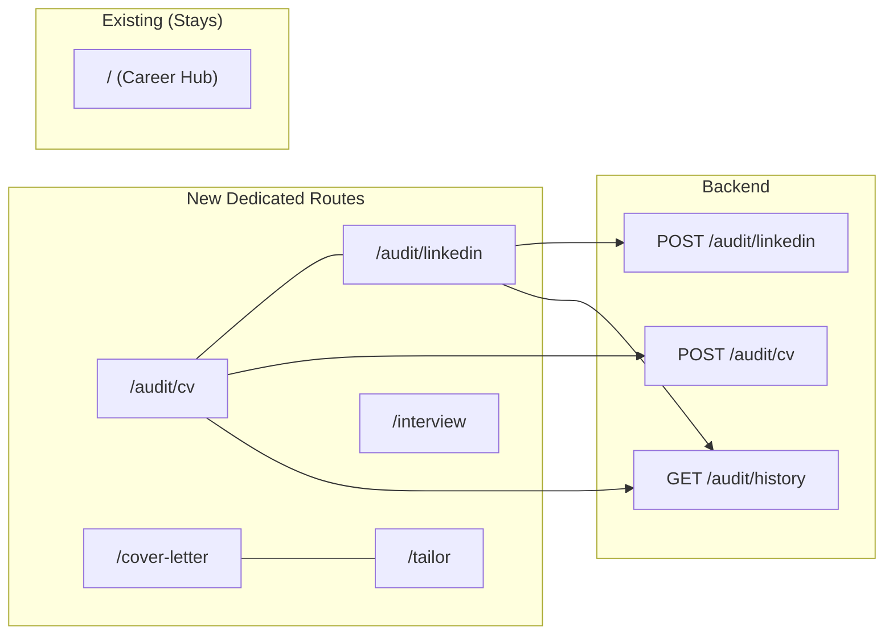
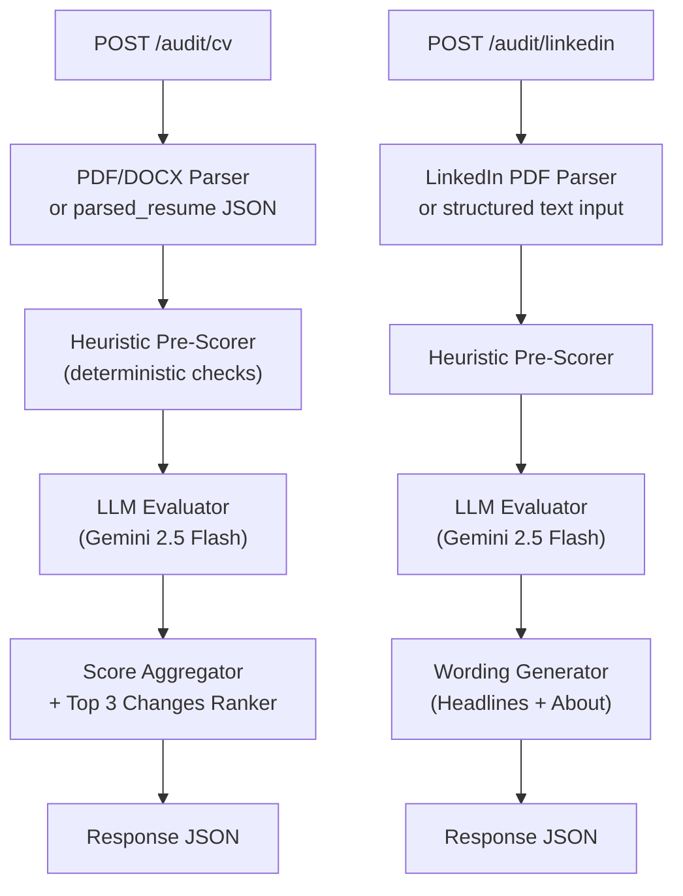

# SmartApply AI — Career Audit Suite & Dedicated Multi-Page Architecture

## Executive Summary

Transform SmartApply from a single-page dashboard into a **multi-page career optimization platform** with two flagship new features — **AI CV Audit** and **AI LinkedIn Profile Audit** — modeled after FlyRank's scoring system. Every major tool gets its own SEO-optimized dedicated route. Premium kinetic typography animations powered by **GSAP SplitText** and **Cheng Lou's Pretext** engine create a visual experience that feels alive.



---

## User Review Required

> [!IMPORTANT]
> **Pretext vs. GSAP SplitText**: Both are already feasible. GSAP (`gsap: ^3.15.0`) is already in your `package.json`. Pretext (`@chenglou/pretext`) needs to be installed (~4KB gzipped). The plan uses **GSAP SplitText** for hero text character-stagger reveals on every page and **Pretext** for real-time kinetic text reflow effects in the audit score animation (text flowing around the animated score gauge). This combination is unique and jaw-dropping.

> [!WARNING]
> **SEO Route Architecture**: Moving Cover Letter, Tailor, and Interview to dedicated routes means updating internal links across the existing codebase (Navbar, page.tsx feature cards, ResumeUpload tab actions). The plan handles this comprehensively.

---

## Part 1: Animation System — Kinetic Typography Engine

### Philosophy
Every dedicated page gets a **hero section** with premium text animations that make the user go "wow" on first visit. Three tiers of motion:

| Tier | Technology | Where Used | Effect |
|------|-----------|------------|--------|
| **Hero Reveal** | GSAP SplitText + ScrollTrigger | Page headings on every route | Characters slide up from behind a mask with staggered 0.02s delay, 3D perspective rotation |
| **Score Reflow** | Cheng Lou's Pretext | Audit score gauge area | Text dynamically reflows around the animated circular score gauge as it fills — like water flowing around a stone |
| **Micro-motion** | Framer Motion (existing) | Cards, buttons, modals | `whileHover`, `whileInView`, `AnimatePresence` transitions between routes (already wired in Providers.tsx) |

### [NEW] `frontend/src/components/KineticText.tsx`
A reusable component wrapping GSAP SplitText:

```tsx
// Usage: <KineticText as="h1" className="..." animation="hero-rise">
//          Free AI Resume Audit
//        </KineticText>
```

**Animation Presets**:
- `hero-rise`: Characters rise from below with `mask: true`, stagger `0.025s`, `rotationX: -90` → `0`, `opacity: 0` → `1`. The "snake crawling through text" effect the user asked for.
- `word-fade`: Words fade and slide in per-word with `y: 30` stagger.
- `scramble-decode`: Characters cycle through random glyphs before settling — like a hacker terminal decoding a message. Built with a custom `requestAnimationFrame` loop (no external dependency).
- `counter-roll`: Numbers roll up digit-by-digit for score displays (audit scores, ATS percentages).

**Accessibility**: Respects `prefers-reduced-motion` media query. Falls back to instant display. GSAP SplitText v3.15+ auto-manages `aria-label` / `aria-hidden`.

### [NEW] `frontend/src/components/PretextReflow.tsx`
Uses `@chenglou/pretext` for the audit results page — text paragraphs dynamically reflow around the circular score gauge as it animates from 0→final score. The `prepare()` → `layout()` pipeline runs at 60fps without DOM thrashing.

### [MODIFY] `frontend/package.json`
```diff
+ "@gsap/react": "^2.1.0",
+ "@chenglou/pretext": "^0.3.0"
```

---

## Part 2: Backend — Audit Scoring Engine

### Architecture



**Why a hybrid approach?** Pure-LLM scoring is expensive, slow, and non-deterministic. A hybrid model runs ~20 deterministic heuristic checks first (contact detection, link validation, section heading recognition, page count, skill keyword matching) and only sends the remaining subjective evaluations (bullet quality, writing tone, storytelling) to Gemini Flash. This cuts latency from ~8s to ~2.5s and makes scores reproducible.

---

### [NEW] `backend/app/services/audit_engine.py`
The core scoring engine — framework-agnostic, testable, no HTTP dependency.

#### CV Audit Rubric (25 criteria, 100 points)

| # | Dimension | Max Pts | Criteria | Scoring Method |
|---|-----------|---------|----------|----------------|
| **A** | **Can Software Read Your CV?** | **20** | | |
| A1 | Name, email, main sections readable | 4 | Are ≥2 of 3 core field groups (name, email, experience/education) extracted? | **Heuristic**: Regex/parser field detection |
| A2 | Contact details in main document body | 4 | Email/phone found outside header/footer regions? | **Heuristic**: Position analysis in parsed text |
| A3 | Sections read in correct order | 4 | Single-column layout, logical section flow? | **Heuristic**: Section heading sequence validation |
| A4 | Clear section headings | 3 | Uses standard ATS headings (Experience, Education, Skills, Projects)? | **Heuristic**: Heading keyword matching against ATS standard list |
| A5 | Length & content density | 2 | 1 page for <5yr experience, max 2 pages? | **Heuristic**: Page count from parser |
| A6 | Readable text & contrast | 3 | Parseable text, not image-based PDF? | **Heuristic**: Text extraction success rate |
| **B** | **Contact & Links** | **10** | | |
| B1 | Core contact details | 3 | Email found, location/phone found? | **Heuristic**: Regex patterns |
| B2 | LinkedIn URL | 2 | Valid linkedin.com/in/ URL present? | **Heuristic**: URL pattern + HTTP HEAD check |
| B3 | Portfolio or GitHub link | 3 | github.com or portfolio domain found? | **Heuristic**: URL pattern matching |
| B4 | Links open correctly | 2 | All extracted URLs return 2xx/3xx? | **Heuristic**: Async HTTP HEAD validation |
| **C** | **Experience & Project Bullets** | **25** | | |
| C1 | Clear descriptions of contributions | 5 | Bullets start with strong action verbs? | **LLM**: Evaluate verb strength and clarity |
| C2 | Specific results or scale | 5 | Quantified metrics (%, $, users, time)? | **Hybrid**: Regex for numbers + LLM for context |
| C3 | XYZ structure (What, How, Result) | 5 | Bullets follow "Accomplished X by doing Y, resulting in Z"? | **LLM**: Structure pattern recognition |
| C4 | Concise bullets | 5 | Each bullet ≤2 lines, no wall-of-text? | **Heuristic**: Character count per bullet |
| C5 | Achievements beyond duties | 5 | Shows impact, not just responsibilities? | **LLM**: Achievement vs. duty classification |
| **D** | **Target Role Fit** | **20** | | |
| D1 | Skills related to target track | 12 | How many target-role keywords found in CV text? | **Hybrid**: Keyword extraction from JD/track + frequency count + LLM contextual matching |
| D2 | Target role near top | 4 | Headline/summary/objective mentions the target role? | **Heuristic**: First 200 chars analysis |
| D3 | Relevant skills shown in work context | 4 | Skills appear inside experience/project bullets, not just Skills section? | **LLM**: Cross-reference skill mentions with bullet context |
| **E** | **Projects & Proof of Work** | **15** | | |
| E1 | Projects section when needed | 4 | Projects section present when <2 years experience? | **Heuristic**: Section detection + experience date analysis |
| E2 | Dates for each role | 2 | Every experience entry has date ranges? | **Heuristic**: Date pattern extraction |
| E3 | Project details (purpose, tools, contribution) | 5 | Each project names tools, your role, and technical decisions? | **LLM**: Completeness evaluation |
| E4 | Project outcomes & artifacts | 4 | Measurable outcomes, deployed links, or repository URLs? | **Hybrid**: URL detection + LLM outcome evaluation |
| **F** | **Specific, Believable Writing** | **10** | | |
| F1 | Specific examples | 4 | Claims backed by concrete examples? | **LLM**: Specificity assessment |
| F2 | Evidence behind claims | 3 | Assertions have supporting detail? | **LLM**: Evidence chain analysis |
| F3 | Consistent language & grammar | 3 | Consistent tense, no grammar errors, professional tone? | **LLM**: Grammar and consistency check |

Each criterion returns a structured result:
```json
{
  "id": "A2",
  "name": "Contact details in main document",
  "max_points": 4,
  "awarded_points": 0,
  "status": "needs_attention",  // "looks_good" | "could_be_stronger" | "needs_attention" | "could_not_check"
  "finding": "Contact details appear only in the page header.",
  "action": "Move your email and phone out of the page header or footer and into the main document.",
  "scoring_method": "heuristic"
}
```

#### LinkedIn Audit Rubric (27 criteria, 100 points)

| # | Dimension | Max Pts | Key Criteria |
|---|-----------|---------|-------------|
| **A** | **Search Visibility** | **30** | Keyword-rich headline (8), industry keywords in headline (6), location present (4), Open to Work enabled (4), custom URL (4), headline length ≥60 chars (4) |
| **B** | **Skills Recruiters Find** | **15** | Top 3 pinned skills match target (6), ≥10 relevant skills listed (5), skills used in experience bullets (4) |
| **C** | **Profile Completeness** | **15** | Photo present (3), banner present (2), custom public URL (2), current position listed (4), education listed (4) |
| **D** | **Profile Writing** | **25** | About section hook (4), About has proof points (4), About has career direction (4), specific claims (4), readability (2), bullet clarity in Experience (4), consistent grammar (3) |
| **E** | **Proof of Work** | **10** | Featured section items (4), recommendations (3), certifications (3) |
| **F** | **Activity & Engagement** | **5** | Recent posts (guidance only, not hard-scored — mirrors FlyRank's "could not check" pattern) |

**AI-Generated Suggestions** (returned alongside scores):
- 3 Headline formulas: `{Role} | {Specialization} | {Top 3 Tools}`
- About section narrative outline: Hook → Proof Point → Stack → Direction → CTA
- Keyword injection guide: Which skills to weave into which Experience bullets

---

### [NEW] `backend/app/routers/audit.py`

```python
router = APIRouter(prefix="/audit", tags=["audit"])

@router.post("/cv")        # Accept file upload (PDF/DOCX) OR JSON body
@router.post("/linkedin")  # Accept LinkedIn PDF OR structured text
@router.get("/history/{user_id}")  # Score evolution timeline
@router.post("/save")      # Persist audit result
```

**File upload handling**: Uses FastAPI's `UploadFile` with the existing PDF text extraction pipeline (already in `backend/app/services/` for resume parsing). LinkedIn PDF uses the same extractor — LinkedIn's "Save to PDF" produces a structured text-layer PDF.

**Response Model** (`AuditResponse`):
```json
{
  "audit_type": "cv",
  "total_score": 39,
  "max_score": 100,
  "quality_label": "Needs improvement",
  "criteria_checked": 16,
  "criteria_passed": 9,
  "criteria_stronger": 2,
  "criteria_attention": 5,
  "criteria_skipped": 9,
  "top_3_changes": [
    {
      "rank": 1,
      "action": "Show relevant skills where you used them in experience or projects.",
      "potential_increase": 9,
      "estimated_effort": "about an hour",
      "rationale": "We found 3 skills related to ML: python, scikit-learn, numpy."
    }
  ],
  "dimensions": [
    {
      "name": "Can software read your CV?",
      "subtitle": "Text, sections, reading order, length, and layout",
      "score": 9,
      "max_score": 20,
      "criteria": [ /* array of criterion results */ ]
    }
  ],
  "suggested_wording": null,  // populated for LinkedIn audits
  "previous_score": null,     // populated if history exists
  "score_delta": null
}
```

### [NEW] `backend/app/services/audit_prompts.py`
LLM prompt templates for the subjective criteria evaluations, following the existing `llm_prompts.py` pattern with `MASTER_SYSTEM_PREFIX`, `<DATA>` sandboxing, and constrained JSON schema output.

### [MODIFY] `backend/app/main.py`
```diff
  from app.routers import (
      intake, profiles, tailor, jobs, apply, cover_letter,
-     templates, render, billing, analytics, interview, admin,
+     templates, render, billing, analytics, interview, admin, audit,
      auth_sync, mock, chat, privacy
  )
+ app.include_router(audit.router)
```

### [NEW] `supabase/migrations/20260827000001_audit_history.sql`
```sql
CREATE TABLE IF NOT EXISTS audit_history (
    id UUID PRIMARY KEY DEFAULT gen_random_uuid(),
    user_id UUID NOT NULL,
    audit_type TEXT NOT NULL CHECK (audit_type IN ('cv', 'linkedin')),
    total_score INTEGER NOT NULL,
    max_score INTEGER NOT NULL DEFAULT 100,
    dimensions JSONB NOT NULL,
    top_3_changes JSONB,
    target_role TEXT,
    created_at TIMESTAMPTZ NOT NULL DEFAULT now()
);
CREATE INDEX idx_audit_history_user ON audit_history(user_id, audit_type, created_at DESC);
```

---

## Part 3: Frontend — Dedicated Pages & SEO Suite

### Site Architecture

```
frontend/src/app/
├── layout.tsx              (root — title template, metadataBase)
├── page.tsx                (/ — Career Hub with feature cards)
├── sitemap.ts              [NEW] — Dynamic sitemap.xml
├── robots.ts               [NEW] — robots.txt with sitemap ref
├── audit/
│   ├── cv/
│   │   └── page.tsx        [NEW] — CV Audit Studio
│   └── linkedin/
│       └── page.tsx        [NEW] — LinkedIn Profile Audit Studio
├── cover-letter/
│   └── page.tsx            [NEW] — Cover Letter Generator Studio
├── tailor/
│   └── page.tsx            [NEW] — Resume Tailoring & Match Studio
├── interview/
│   └── page.tsx            (EXISTS — AI Mock Interview, minor wiring updates)
├── billing/
│   └── page.tsx            (EXISTS)
├── settings/
│   └── page.tsx            (EXISTS)
└── reset-password/
    └── page.tsx            (EXISTS)
```

### SEO Strategy — Per-Page Metadata

Every new page exports `metadata` with:
- **Unique title** using the root layout template pattern: `%s | SmartApply AI`
- **Meta description** — 155-char actionable description targeting long-tail keywords
- **OpenGraph** — title, description, type, image (dynamic via `opengraph-image.tsx`)
- **Canonical URL** — prevents duplicate content
- **JSON-LD** — `WebApplication` schema for each tool page

#### [MODIFY] `frontend/src/app/layout.tsx`
```diff
  export const metadata: Metadata = {
-   title: "SmartApply AI — AI Resume Generator & Smart Apply",
+   title: {
+     template: "%s | SmartApply AI",
+     default: "SmartApply AI — AI Resume Builder, CV Audit & Career Tools",
+   },
+   metadataBase: new URL("https://smartapply.ai"),
    description: "...",
+   alternates: { canonical: "/" },
  };
```

#### Example: `/audit/cv/page.tsx` metadata
```typescript
export const metadata: Metadata = {
  title: "Free AI Resume Audit — Score Your CV in 30 Seconds",
  description: "Get an instant AI-powered resume audit with a 25-criteria ATS score, actionable fixes ranked by impact, and a detailed breakdown across 6 dimensions. Free, no sign-up required.",
  alternates: { canonical: "/audit/cv" },
  openGraph: {
    title: "Free AI Resume Audit — SmartApply AI",
    description: "Upload your resume PDF and get a detailed ATS audit score with the top 3 changes to improve your chances.",
    type: "website",
  },
};
```

Plus JSON-LD script injected in page body:
```json
{
  "@context": "https://schema.org",
  "@type": "WebApplication",
  "name": "SmartApply AI Resume Audit",
  "applicationCategory": "BusinessApplication",
  "operatingSystem": "Web Browser",
  "offers": { "@type": "Offer", "price": "0", "priceCurrency": "USD" },
  "description": "AI-powered 25-criteria resume audit..."
}
```

#### [NEW] `frontend/src/app/sitemap.ts`
```typescript
export default function sitemap(): MetadataRoute.Sitemap {
  return [
    { url: "https://smartapply.ai", lastModified: new Date(), changeFrequency: "weekly", priority: 1 },
    { url: "https://smartapply.ai/audit/cv", lastModified: new Date(), changeFrequency: "weekly", priority: 0.9 },
    { url: "https://smartapply.ai/audit/linkedin", lastModified: new Date(), changeFrequency: "weekly", priority: 0.9 },
    { url: "https://smartapply.ai/cover-letter", lastModified: new Date(), changeFrequency: "weekly", priority: 0.8 },
    { url: "https://smartapply.ai/tailor", lastModified: new Date(), changeFrequency: "weekly", priority: 0.8 },
    { url: "https://smartapply.ai/interview", lastModified: new Date(), changeFrequency: "weekly", priority: 0.8 },
  ];
}
```

---

### Page Designs

#### `/audit/cv` — AI Resume Audit Studio

**Layout** (top to bottom):
1. **Hero Section**: `KineticText` with `hero-rise` animation — "Audit Your Resume in 30 Seconds" with teal-to-emerald gradient text
2. **Upload Zone**: Drag-and-drop PDF/DOCX zone OR "Use My Saved Profile" glassmorphic button. Optional "Target Role" and "Paste Job Description" inputs for role-specific scoring.
3. **Processing Animation**: While waiting (~2.5s), show a glowing progress ring with `scramble-decode` text cycling through scanning stages: "Extracting text…" → "Checking ATS readability…" → "Evaluating bullet impact…" → "Ranking improvements…"
4. **Score Display**: 
   - Large animated circular gauge (0→score, `counter-roll` digits inside) with qualitative badge (`Needs improvement` / `Good foundation` / `Strong resume` / `Exceptional`).
   - If prior audit exists: `↑ 21 points higher than your previous audit` delta badge.
   - Pretext reflow effect: descriptive paragraph text dynamically flows around the score circle.
5. **"Start with these 3 changes"** section: Three priority cards with:
   - Rank number with gradient circle
   - Action title (bold)
   - `Potential score increase: up to +X` badge
   - Estimated effort pill (`Usually a few minutes` / `May take about an hour`)
   - Detailed rationale paragraph
6. **Score Breakdown Accordion**: 6 collapsible dimension panels, each showing:
   - Dimension title + score fraction (`9/20`)
   - Individual criteria with status badges: ✅ `Looks good` (emerald), ⚠️ `Could be stronger` (amber), ❌ `Needs attention` (rose), ⬜ `Could not check` (slate)
   - "What we found" + "What to do" per criterion
7. **"Text Our Engine Could Read"** drawer: Expandable panel showing the raw extracted text so users can verify parsing quality.
8. **Quick Actions Footer**: "Download Audit Report (PDF)" + "Re-audit" + "Tailor Resume for This Role →" CTA linking to `/tailor`.

#### `/audit/linkedin` — LinkedIn Profile Audit Studio

Similar structure to CV audit, with LinkedIn-specific additions:
- **Input**: LinkedIn PDF upload (from "More → Save to PDF") OR structured text fields (Headline, About, Experience bullets, Skills list)
- **Score Display**: Same animated gauge with LinkedIn blue accent variant
- **Suggested Profile Wording Studio** (unique to LinkedIn):
  - 3 copyable Headline ideas with "Copy" buttons, shown as glassmorphic cards
  - About Section outline as a structured template with placeholder fills
  - "Before → After" keyword density heatmap
- **Recruiter Visibility Radar**: Spider/radar chart showing Search Visibility, Skills Match, Completeness, Writing Quality, Proof of Work dimensions

#### `/cover-letter` — AI Cover Letter Generator Studio

Self-contained page wrapping the existing `CoverLetterPanel.tsx` component with:
- SEO hero section with `KineticText`
- Full-width layout (no longer a modal/overlay)
- Tone selector (Professional, Technical, Creative, Conversational)
- Side-by-side JD input → Generated letter preview
- 1-click copy, PDF download, and "Generate Another" flow
- "Pair with Resume Tailor →" CTA to `/tailor`

#### `/tailor` — Resume Tailoring & ATS Match Studio

Self-contained page wrapping the existing `TailorPanel.tsx` with:
- SEO hero section
- JD paste input with "Pull from Job Search" button (pre-fills from saved jobs)
- Visual ATS match score gauge
- Gap analysis panel (matching skills ✅, missing skills ❌, suggested additions 💡)
- Side-by-side: Original bullets → AI-rewritten bullets with diff highlighting
- Truthfulness gate verification panel
- "Download Tailored Resume" + "Generate Cover Letter →" CTA

#### `/interview` — AI Mock Interview (existing, minor updates)

- Add SEO metadata export
- Add `KineticText` hero section
- Wire into new Navbar routes
- No functional changes needed — the page already works standalone

---

### [MODIFY] `frontend/src/components/Navbar.tsx` — Mega-Menu Navigation

Replace the current hamburger flyout with a **responsive mega-menu dropdown** system:

```
┌─────────────────────────────────────────────────┐
│ SmartApply AI    [Audit ▼] [Create ▼] [Practice ▼]  [🔊] [🌙] [👤] │
└─────────────────────────────────────────────────┘
         │              │                │
    ┌────┴────┐    ┌────┴────┐     ┌────┴────┐
    │ CV Audit│    │ Tailor  │     │ Job Hub │
    │ LinkedIn│    │ Cover   │     │Interview│
    │  Audit  │    │ Letter  │     │ Tracker │
    │         │    │Templates│     │Analytics│
    └─────────┘    └─────────┘     └─────────┘
```

**Implementation**: Three dropdown groups, each with icon + title + subtitle. Active route gets a teal indicator dot. Mobile: full-screen slide-out with the same groups as accordion sections.

### [MODIFY] `frontend/src/app/page.tsx` — Updated Feature Cards

Add two new feature cards to the homepage grid:
- **AI Resume Audit** card with `FileSearch` icon → links to `/audit/cv`
- **LinkedIn Audit** card with `Linkedin` icon → links to `/audit/linkedin`
- Update existing cards to link to dedicated routes (`/cover-letter`, `/tailor`, `/interview`)

---

## Part 4: Shared Components & Layout

### [NEW] `frontend/src/components/AuditScoreGauge.tsx`
Reusable animated circular score gauge:
- SVG circle with `stroke-dashoffset` animation driven by GSAP
- Central score number with `counter-roll` animation
- Color transitions: `0-30` rose → `31-60` amber → `61-80` teal → `81-100` emerald
- Qualitative label badge below

### [NEW] `frontend/src/components/AuditCriterionCard.tsx`
Single criterion display card:
- Status icon + badge (`Looks good` / `Could be stronger` / `Needs attention` / `Could not check`)
- Score fraction (`4/4`)
- "What we found" text
- "What to do" action text (conditionally shown)
- Expand/collapse for detail

### [NEW] `frontend/src/components/TopChangesRoadmap.tsx`
The "Start with these 3 changes" hero banner:
- Three priority cards in a grid
- Gradient rank numbers (1, 2, 3)
- Potential score increase badges
- Effort estimation pills
- Animated entrance with Framer Motion `staggerChildren`

### [NEW] `frontend/src/components/PageHero.tsx`
Reusable hero section for all dedicated pages:
- `KineticText` heading with configurable animation preset
- Subtitle with `word-fade` animation
- Optional breadcrumb trail
- Accent glow orbs (existing `accent-glow-spot` utility)
- Consistent spacing and responsive sizing

---

## Part 5: Cross-Cutting Concerns

### Authentication
- **Audit tools work without login** (guest mode with `localStorage` persistence)
- Logged-in users get audit history tracking and score evolution
- Pattern mirrors existing `/tailor` endpoint: `get_optional_user` dependency

### Performance Budget
| Metric | Target |
|--------|--------|
| CV Audit API latency | < 3s (hybrid heuristic + Flash) |
| LinkedIn Audit API latency | < 3s |
| Page load (LCP) | < 2.5s (Next.js SSR + static metadata) |
| Animation FPS | 60fps (GSAP on compositor thread) |
| Pretext text layout | < 0.5ms per reflow |

### Error Handling
- If PDF parsing fails: show "We couldn't read this file" with suggestions (try DOCX, try simpler layout)
- If LLM call fails: return heuristic-only scores with `could_not_check` for LLM criteria (graceful degradation)
- Circuit breaker pattern already exists in `llm_client.py` — audit engine reuses it

---

## Verification Plan

### Automated Tests

#### Backend
```bash
# Unit test: audit scoring engine with mock resume data
cd backend && python -m pytest tests/test_audit_engine.py -v

# Integration test: /audit/cv and /audit/linkedin endpoints
cd backend && python -m pytest tests/test_audit_endpoints.py -v
```

#### Frontend
```bash
# Component tests: KineticText, AuditScoreGauge, TopChangesRoadmap render correctly
cd frontend && npx vitest run
```

### Manual Verification
1. **CV Audit E2E**: Upload Eyad's resume PDF → verify 25-criteria breakdown, score ~39/100 (matching FlyRank's actual result), top 3 changes match expected priorities
2. **LinkedIn Audit E2E**: Paste LinkedIn profile text → verify 27-criteria breakdown, 3 headline suggestions, About outline
3. **Score History**: Run audit twice → verify delta badge shows improvement
4. **Navigation**: Click through every Navbar link → verify all routes load with correct metadata
5. **SEO Validation**: Inspect `<head>` tags on each page → verify title, description, canonical, JSON-LD
6. **Animation**: Verify hero text animations play on page load, score gauge animates, `prefers-reduced-motion` disables animations
7. **Mobile**: Test all pages on mobile viewport (375px) → verify responsive layouts and touch-friendly interactions

---

## Implementation Order

| Phase | Files | Effort |
|-------|-------|--------|
| **1. Animation System** | `KineticText.tsx`, `PretextReflow.tsx`, `PageHero.tsx`, `package.json` | ~2 hours |
| **2. Backend Audit Engine** | `audit_engine.py`, `audit_prompts.py`, `audit.py`, schemas, migration | ~4 hours |
| **3. Shared UI Components** | `AuditScoreGauge.tsx`, `AuditCriterionCard.tsx`, `TopChangesRoadmap.tsx` | ~2 hours |
| **4. CV Audit Page** | `audit/cv/page.tsx` | ~3 hours |
| **5. LinkedIn Audit Page** | `audit/linkedin/page.tsx` | ~2 hours |
| **6. Dedicated Tool Pages** | `cover-letter/page.tsx`, `tailor/page.tsx`, interview metadata | ~2 hours |
| **7. Navbar & Navigation** | `Navbar.tsx` mega-menu, `page.tsx` cards, internal links | ~2 hours |
| **8. SEO Infrastructure** | `layout.tsx` template, `sitemap.ts`, `robots.ts`, JSON-LD | ~1 hour |
| **9. Testing & Polish** | Backend tests, frontend tests, manual E2E, animation tuning | ~2 hours |

**Total estimated: ~20 hours of implementation**
